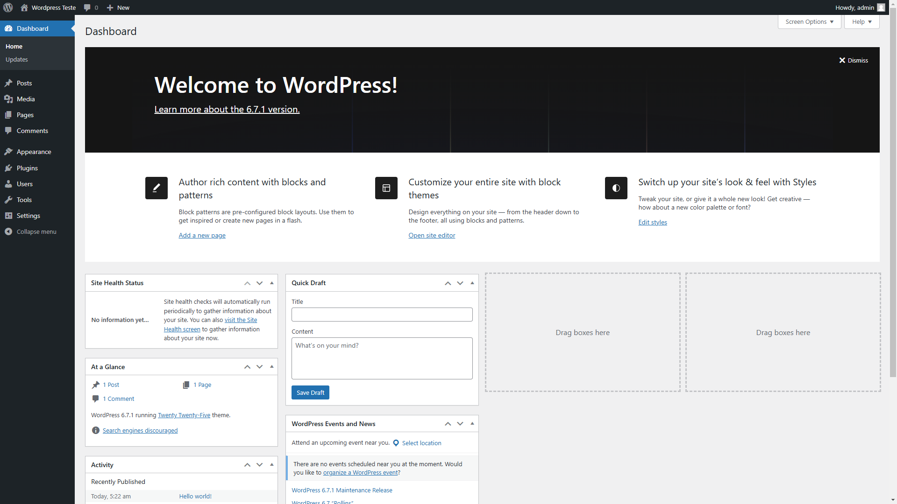

# Construindo um Container Wordpress

Siga os babies steps abaixo:

## Passo 1: Testando o worpress localmente:

1. Baixar a imagem (pode ser baixada durante a )
   No link official da image : pull wordpress, mas por questões de eficiencia, podemos fazer o pull da imagem diretamente no run.

`> docker run -d -p 3002:80 --name 
wordpress_app_v2 wordpress`

- Esse comando está criando um container que está rodando em modo detached(no background), ou seja ele não vai ficar executando no terminal. `-p 3002:80`, a 3002 indica a porta que está sendo exposta no host para acessar a aplicação wordpress que está sendo exposta na porta 80(porta padrão da web).
- Agora no browser: localhost:3002, é possível acessar a aplicação wordpress.

O Wordpress por padrão deve receber as informações de um banco de dados para que ele possa realizar consultas. O que configuraremos em breve.


## Passo 2: Testando o wordpress com o banco.

No site oficial: https://hub.docker.com/_/wordpress
Tem um exemplo docker-compose.yml, copie e crie um arquivo .yml no seu diretório.

```
>docker compose up
```

Now you can go into your browser na porta 8080.
localhost:8080



-
